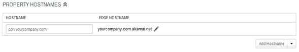
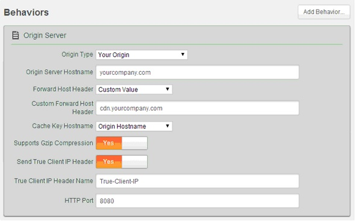
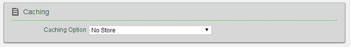
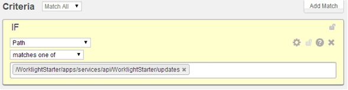
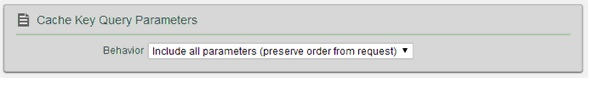
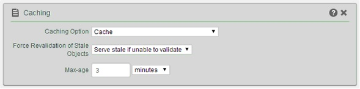

---

copyright:
  years: 2020
lastupdated: "2020-04-29"

keywords: Direct Update, CDN support, secure direct update, mobile app update, mobile app development

subcollection:  mobilefoundation-sw

---

{:external: target="_blank" .external}
{:shortdesc: .shortdesc}
{:codeblock: .codeblock}
{:pre: .pre}
{:term: .term}
{:screen: .screen}
{:tsSymptoms: .tsSymptoms}
{:tsCauses: .tsCauses}
{:tsResolve: .tsResolve}
{:tip: .tip}
{:important: .important}
{:note: .note}
{:download: .download}
{:java: .ph data-hd-programlang='java'}
{:ruby: .ph data-hd-programlang='ruby'}
{:c#: .ph data-hd-programlang='c#'}
{:objectc: .ph data-hd-programlang='Objective C'}
{:python: .ph data-hd-programlang='python'}
{:javascript: .ph data-hd-programlang='javascript'}
{:php: .ph data-hd-programlang='PHP'}
{:swift: .ph data-hd-programlang='swift'}
{:reactnative: .ph data-hd-programlang='React Native'}
{:csharp: .ph data-hd-programlang='csharp'}
{:ios: .ph data-hd-programlang='iOS'}
{:android: .ph data-hd-programlang='Android'}
{:cordova: .ph data-hd-programlang='Cordova'}
{:xml: .ph data-hd-programlang='xml'}

# Advanced Direct Update configuration
{: #advanced_direct_update_configuration}

Described here are some of the advanced ways in which you can configure and work with Direct Update feature.

## Customizing the Direct Update UI
{: #customize_du_ui}

Direct Update UI presented to the user can be customized.
Add the following inside the `wlCommonInit()` function in **index.js**:

```JavaScript
wl_DirectUpdateChallengeHandler.handleDirectUpdate = function(directUpdateData, directUpdateContext) {
    // Implement custom Direct Update logic
};
```
{: codeblock}

`directUpdateData` is a [JSON](#x4267096){: term} object that contains the downloadSize property that represents the file size (in bytes) of the update package to be downloaded from {{site.data.keyword.mobilefoundation_short}} server.
`directUpdateContext` is a JavaScript object that exposes the `.start()` and `.stop()` functions, which start and stop the Direct Update flow.

If the web resources are newer on the {{site.data.keyword.mobilefoundation_short}} server than in the application, Direct Update challenge data is added to the server response. Whenever the {{site.data.keyword.mobilefoundation_short}} client-side framework detects this direct update challenge, it starts the `wl_directUpdateChallengeHandler.handleDirectUpdate` function.

The function provides a default Direct Update design: A default message dialog that is displayed when a Direct Update is available and a default progress screen that is displayed when the direct update process is initiated. You can implement custom Direct Update user interface behavior or customize the Direct Update dialog box by overriding this function and implementing your own logic.

In the following example code, a `handleDirectUpdate` function implements a custom message in the Direct Update dialog. Add this code into the `www/js/index.js` file of the Cordova project.
Some examples for a customized Direct Update UI:

* A dialog that is created by using a third-party JavaScript [framework](#x2023472){: term} (such as Dojo or jQuery Mobile, Ionic, …)
* Fully native UI by running a Cordova plug-in
* An alternative HTML that is presented to the user with options


```JavaScript
wl_directUpdateChallengeHandler.handleDirectUpdate = function(directUpdateData, directUpdateContext) {        
    navigator.notification.confirm(  // Creates a dialog.
        'Custom dialog body text',
        // Handle dialog buttons.
          directUpdateContext.start();
        },
        'Custom dialog title text',
        ['Update']
    );
};
```
{: codeblock}

You can start the Direct Update process by running the `directUpdateContext.start()` method whenever the user clicks the dialog button. The default progress screen, which resembles the one in previous versions of {{site.data.keyword.mobilefoundation_short}} server is shown.

This method supports the following types of invocation:

* When no parameters are specified, the {{site.data.keyword.mobilefoundation_short}} server uses the default progress screen.
* When a listener function such as `directUpdateContext.start(directUpdateCustomListener)` is supplied, the Direct Update process runs in the background while the process sends lifecycle events to the listener. The custom listener must implement the following methods:

```JavaScript
var  directUpdateCustomListener  = {
    onStart : function ( totalSize ){ },
    onProgress : function ( status , totalSize , completedSize ){ },
    onFinish : function ( status ){ }
};
```
{: codeblock}

The listener methods are started during the direct update process according to following rules:

* `onStart` is called with the `totalSize` parameter that holds the size of the update file.
* `onProgress` is called multiple times with status `DOWNLOAD_IN_PROGRESS`, `totalSize`, and `completedSize` (the volume that is downloaded so far).
* `onProgress` is called with status `UNZIP_IN_PROGRESS`.
* `onFinish` is called with one of the following final status codes:

| Status code | Description |
|:------------|:------------|
| `SUCCESS` | Direct update finished with no errors. |
| `CANCELED` | Direct update was canceled (for example, because the `stop()` method was called). |
| `FAILURE_NETWORK_PROBLEM` | There was a problem with a network connection during the update. |
| `FAILURE_DOWNLOADING` | The file was not downloaded completely. |
| `FAILURE_NOT_ENOUGH_SPACE` | There is not enough space on the device to download and unpack the update file. |
| `FAILURE_UNZIPPING` | There was a problem in unpacking the update file. |
| `FAILURE_ALREADY_IN_PROGRESS` | The start method was called while direct update was already running. |
| `FAILURE_INTEGRITY` | Authenticity of update file cannot be verified. |
| `FAILURE_UNKNOWN` | Unexpected internal error. |
{: caption="Table 1. Status codes" caption-side="top"}

If you implement a custom direct update listener, you must ensure that the app is reloaded when the direct update process is complete and the `onFinish()` method is called. You must also call `wl_directUpdateChalengeHandler.submitFailure()` if the direct update process fails to complete successfully.

The following example shows an implementation of a custom direct update listener:

```JavaScript
var directUpdateCustomListener = {
  onStart: function(totalSize){
    //show custom progress dialog
  },
  onProgress: function(status,totalSize,completedSize){
    //update custom progress dialog
  },
  onFinish: function(status){

    if (status == 'SUCCESS'){
      //show success message
      WL.Client.reloadApp();
    }
    else {
      //show custom error message

      //submitFailure must be called is case of error
      wl_directUpdateChallengeHandler.submitFailure();
    }
  }
};

wl_directUpdateChallengeHandler.handleDirectUpdate = function(directUpdateData, directUpdateContext){

  WL.SimpleDialog.show('Update Avalible', 'Press update button to download version 2.0', [{
    text : 'update',
    handler : function() {
      directUpdateContext.start(directUpdateCustomListener);
    }
  }]);
};
```
{: codeblock}

## Running UI-less direct updates
{: #scenario-running-ui-less-direct-updates }

{{site.data.keyword.mobilefoundation_short}} supports UI-less direct update when the application is in the foreground.

To run UI-less direct updates, implement `directUpdateCustomListener`. Provide empty function implementations to the `onStart` and `onProgress` methods. Empty implementations cause the direct update process to run in the background.

To complete the direct update process, the application must be reloaded. The following options are available:

* The `onFinish` method can be empty as well. In this case, direct update will apply after the application restarted.
* You can implement a custom dialog that informs or requires the user to restart the application. (See the following example.)
* The `onFinish` method can enforce a reload of the application by calling `WL.Client.reloadApp()`.

Here is an example implementation of `directUpdateCustomListener`:

```JavaScript
var directUpdateCustomListener = {
  onStart: function(totalSize){
  },
  onProgress: function(status,totalSize,completeSize){
  },
  onFinish: function(status){
    WL.SimpleDialog.show('New Update Available', 'Press reload button to update to new version', [ {
      text : WL.ClientMessages.reload,
      handler : WL.Client.reloadApp
    }]);
  }
};
```
{: codeblock}

Implement the `wl_directUpdateChallengeHandler.handleDirectUpdate` function. Pass the `directUpdateCustomListener` implementation that you created as a parameter to the function. Make sure `directUpdateContext.start(directUpdateCustomListener`) is called. Here is an example `wl_directUpdateChallengeHandler.handleDirectUpdate` implementation:

```JavaScript
wl_directUpdateChallengeHandler.handleDirectUpdate = function(directUpdateData, directUpdateContext){

  directUpdateContext.start(directUpdateCustomListener);
};
```
{: codeblock}

When the application is sent to the background, the direct-update process is suspended.
{: note}

## Handling a direct update failure
{: #scenario-handling-a-direct-update-failure }

Here, you learn how to handle a direct update failure that might occur, for example, by loss of connectivity. In this scenario, the user is prevented from using the app even in offline mode. A dialog is displayed offering the user the option to try again.

1. Create a global variable to store the direct update context, you can use it later when the direct update process fails. For example,

   ```JavaScript
   var savedDirectUpdateContext;
   ```
   {: codeblock}

1. Implement a direct update challenge handler. Save the direct update context here. For example,

   ```JavaScript
   wl_directUpdateChallengeHandler.handleDirectUpdate = function(directUpdateData, directUpdateContext){

     savedDirectUpdateContext = directUpdateContext; // save direct update context

     var downloadSizeInMB = (directUpdateData.downloadSize / 1048576).toFixed(1).replace(".", WL.App.getDecimalSeparator());
     var directUpdateMsg = WL.Utils.formatString(WL.ClientMessages.directUpdateNotificationMessage, downloadSizeInMB);

     WL.SimpleDialog.show(WL.ClientMessages.directUpdateNotificationTitle, directUpdateMsg, [{
       text : WL.ClientMessages.update,
       handler : function() {
         directUpdateContext.start(directUpdateCustomListener);
       }
     }]);
   };
   ```
   {: codeblock}

1. Create a function that starts the direct update process by using the direct update context. For example,

   ```JavaScript
   restartDirectUpdate = function () {
     savedDirectUpdateContext.start(directUpdateCustomListener); // use saved direct update context to restart direct update
   };
   ```
   {: codeblock}

1. Implement `directUpdateCustomListener`. Add status checking in the `onFinish` method. If the status starts with `FAILURE`, open a modal only dialog with the option **Try Again**. For example,

   ```JavaScript
   var directUpdateCustomListener = {
     onStart: function(totalSize){
       alert('onStart: totalSize = ' + totalSize + 'Byte');
     },
     onProgress: function(status,totalSize,completeSize){
       alert('onProgress: status = ' + status + ' completeSize = ' + completeSize + 'Byte');
     },
     onFinish: function(status){
       alert('onFinish: status = ' + status);
       var pos = status.indexOf("FAILURE");
       if (pos > -1) {
         WL.SimpleDialog.show('Update Failed', 'Press try again button', [ {
           text : "Try Again",
           handler : restartDirectUpdate // restart direct update
         }]);
       }
     }
   };
   ```
   {: codeblock}

   When the user clicks the **Try Again** button, the application restarts the direct update process.
   {: note}

## Delta and Full Direct Update
{: #delta-and-full-direct-update }

Delta Direct Updates enables an application to download only the files that were changed since the last update instead of the entire web resources of the application. This reduces download time, conserves bandwidth, and improves overall user experience.

A **delta update** is possible only if the client application's web resources are one version behind the application that is deployed on the server. Client applications that are more than one version behind the currently deployed application (meaning the application was deployed to the server at least twice since the client application was updated), receive a **full update** (meaning that the entire web resources are downloaded and updated).
{: note}

See the Direct Update sample for Cordova app from the **Samples** section. This application demonstrates how to create a custom Direct Update dialog instead of the dialog provided by default.  

## Content Delivery Network (CDN) support
{: #cdn_support}

You can configure Direct Update requests to be served from a CDN (content delivery network) instead of from the {{site.data.keyword.mobilefoundation_short}} server.

Using a CDN instead of the {{site.data.keyword.mobilefoundation_short}} server to serve Direct Update requests has the following advantages:

* Removes network overheads from the {{site.data.keyword.mobilefoundation_short}} server.
* Increases transfer rates higher than the 250 MB/second limit while serving requests from a {{site.data.keyword.mobilefoundation_short}} server.
* Ensures a more uniform Direct Update experience for all users regardless of their geographical location.

### General requirements
{: #general-requirements }

To serve Direct Update requests from a CDN, ensure that your configuration conforms to the following conditions:

* The CDN must be a reverse proxy in front of the {{site.data.keyword.mobilefoundation_short}} server (or in front of another reverse proxy if needed).
* When you are building the application from your development environment, set up your target server to the CDN host and port instead of the host and port of the {{site.data.keyword.mobilefoundation_short}} server. For example, when you run the {{site.data.keyword.mobilefoundation_short}} [CLI](#x2008863){: term} command `mfpdev server add`, provide the CDN host and port.
* In the CDN administration pane, you need to mark the following Direct Update URLs for caching to ensure that the CDN passes all requests to the {{site.data.keyword.mobilefoundation_short}} server except for the Direct Update requests. For Direct Update requests, the CDN determines whether it obtained the content. If it has, it returns it without going to the {{site.data.keyword.mobilefoundation_short}} server; if not, it goes to the {{site.data.keyword.mobilefoundation_short}} server, gets the Direct Update archive (.zip file), and stores it for the next requests for that specific URL. For applications that are built with v8.0 of {{site.data.keyword.mobilefoundation_short}}, the Direct Update [URL](#x2042718){: term} is: `PROTOCOL://DOMAIN:PORT/CONTEXT_PATH/api/directupdate/VERSION/CHECKSUM/TYPE`.

The `PROTOCOL://DOMAIN:PORT/CONTEXT_PATH` prefix is constant for all [runtime](#x2391929){: term} requests. For example,: `http://my.cdn.com:9080/mfp/api/directupdate/0.0.1/742914155/full?appId=com.ibm.DirectUpdateTestApp&clientPlatform=android`

In the example, there are more request parameters that are also part of the request.

* The CDN must allow caching of the request parameters. Two different Direct Update archives might differ only by the request parameters.
* The CDN must support TTL on the Direct Update response. The support is needed to support multiple direct updates for the same version.
* The CDN must not change or remove the HTTP headers that are used in the server-client protocol.

### Example CDN configuration
{: #example-cdn-configuration }

This example is based on using an Akamai CDN configuration that caches the Direct Update archive. The following tasks are completed by the network administrator, the {{site.data.keyword.mobilefoundation_short}} administrator, and the Akamai administrator:

#### Network administrator
{: #network-administrator }

Create another domain in the DNS for your {{site.data.keyword.mobilefoundation_short}} server. For example, if your server domain is `yourcompany.com` you need to create an additional domain such as `cdn.yourcompany.com`.

In the DNS for the new `cdn.yourcompany.com` domain, set a `CNAME` to the domain name that is provided by Akamai. For example, `yourcompany.com.akamai.net`.

#### {{site.data.keyword.mobilefoundation_short}} administrator
{: #mobilefoundation-administrator }

Set the new `cdn.yourcompany.com` domain as the {{site.data.keyword.mobilefoundation_short}} server URL for the {{site.data.keyword.mobilefoundation_short}} applications. For example, for the Ant builder task, the property is:

```xml
<property name="wl.server" value="http://cdn.yourcompany.com/${contextPath}/"/>
```
{: codeblock}

#### Akamai administrator
{: #akamai-administrator }

1. Open the Akamai property manager and set the property **host name** to the value of the new domain.

   

1. On the Default Rule tab, configure the original {{site.data.keyword.mobilefoundation_short}} server host and port, and set the **Custom Forward Host Header** value to the newly created domain.

   

1. From the **Caching Option** list, select **No Store**.

   

1. From the **Static Content configuration** tab, configure the matching criteria according to the Direct Update [URL](#x2042718){: term} of the application. For example, create a condition that states `If Path matches one of direct_update_URL`.

   

1. Configure the cache key behavior to use all request parameters in the cache key (you must do so to cache different Direct Update archives for different applications or versions). For example, from the **Behavior** list, select `Include all parameters (preserve order from request)`.

   

1. Set values similar to the following values to configure the caching behavior to make cache the Direct Update URL and to set TTL.

   

| Field | Value |
|:------|:------|
| Caching Option | Cache |
| Force Revaluation of Stale Objects | Serve stale if unable to validate |
| Max-Age | 3 minutes |
{: caption="Table 2. Fields and values for configuring caching behavior" caption-side="top"}

## Secure Direct Update
{: #secure-dc}

Unavailable by default, Secure Direct Update prevents a 3rd-party attacker from altering the web resources that are transmitted from the {{site.data.keyword.mobilefoundation_short}} server (or from a Content Delivery Network (CDN)) to the client application.

### Enabling Direct Update authenticity
{: #enable-direct-update-authenticity}

Using a preferred tool, extract the public key from the {{site.data.keyword.mobilefoundation_short}} server keystore and convert it to base64.  
The produced value should then be used as instructed in the following steps:

1. Open a **Command-line** window and navigate to the root of the Cordova project.
1. Run the command: `mfpdev app config` and select the **Direct Update Authenticity public key** option.
1. Provide the public key and confirm.

Any future Direct Update deliveries to client applications are protected by Direct Update authenticity.

For secure Direct Update to work, a user-defined keystore file must be deployed in {{site.data.keyword.mobilefoundation_short}} server and a copy of the matching public key must be included in the deployed client application.

This topic describes how to bind a public key to new client applications and existing client applications that were upgraded. For more information on configuring the keystore in {{site.data.keyword.mobilefoundation_short}} server, see [Configuring the {{site.data.keyword.mobilefoundation_short}} server keystore](https://mobilefirstplatform.ibmcloud.com/tutorials/en/foundation/8.0/authentication-and-security/configuring-the-mobilefirst-server-keystore/){: external}

The server provides a built-in keystore that can be used for testing secure Direct Update for development phases.

After you bind the public key to the client application and rebuild it, you do not need to upload it again to the {{site.data.keyword.mobilefoundation_short}} server. However, if you previously published the application to the market, without the public key, you must republish it.
{: note}

For development purposes, the following default, dummy public key is provided with {{site.data.keyword.mobilefoundation_short}} server:

```xml
-----BEGIN PUBLIC KEY-----
MIIDPjCCAiagAwIBAgIEUD3/bjANBgkqhkiG9w0BAQsFADBgMQswCQYDVQQGEwJJTDELMAkGA1UECBMCSUwxETA
PBgNVBAcTCFNoZWZheWltMQwwCgYDVQQKEwNJQk0xEjAQBgNVBAsTCVdvcmtsaWdodDEPMA0GA1UEAxMGV0wgRG
V2MCAXDTEyMDgyOTExMzkyNloYDzQ3NTAwNzI3MTEzOTI2WjBgMQswCQYDVQQGEwJJTDELMAkGA1UECBMCSUwxE
TAPBgNVBAcTCFNoZWZheWltMQwwCgYDVQQKEwNJQk0xEjAQBgNVBAsTCVdvcmtsaWdodDEPMA0GA1UEAxMGV0wg
RGV2MIIBIjANBgkqhkiG9w0BAQEFAAOCAQ8AMIIBCgKCAQEAzQN3vEB2/of7KAvuvyoIt0T7cjaSTjnOBm0N3+q
zx++dh92KpNJXj/a3o4YbwJXkJ7jU8ykjCYvjXRf0hme+HGhiIVwxJo54iqh76skDS5m7DaseFdndZUJ4p7NFVw
I5ixA36ZArSZ/Pn/ej56/RRjBeRI7AEGXUSGojBUPA6J6DYkwaXQRew9l+Q1kj4dTigyKL5Os0vNFaQyYu+bT2E
vnOixQ0DXm94IqmHZamZKbZLrWcOEfuAsSjKYOdMSM9jkCiHaKcj7fpEZhUxRRs7joKs1Ri4ihs6JeUvMEiG4gK
l9V3FP/Huy0pfkL0F8xMHgaQ4c/lxS/s3PV0OEg+7wIDAQABMA0GCSqGSIb3DQEBCwUAA4IBAQAgEhhqRl2Rgkt
MJeqOCRcT3uyr4XDK3hmuhEaE0nOvLHi61PoLKnDUNryWUicK/W+tUP9jkN5xRckdzG6TJ/HPySmZ7Adr6QRFu+
xcIMY+/S8j4PHLXBjoqgtUMhkt7S2/thN/VA6mwZpw4Ol0Pa2hyT2TkhQoYYkRwYCk9pxmuBCoH/eCWpSxquNny
RwrY25x0YzccXUaMI8L3/3hzq3mW40YIMiEdpiD5HqjUDpzN1funHNQdsxEIMYsWmGAwOdV5slFzyrH+ErUYUFA
pdGIdLtkrhzbqHFwXE0v3dt+lnLf21wRPIqYHaEu+EB/A4dLO6hm+IjBeu/No7H7TBFm
-----END PUBLIC KEY-----
```
{: codeblock}

Do not use the public key for production purposes.
{: note}

### Generating and deploying the keystore
{: #generating-and-deploying-the-keystore }

There are many tools available for generating certificates and extracting public keys from a keystore. The following example demonstrates the procedures with the JDK keytool utility and openSSL.

1. Extract the public key from the keystore file that is deployed in the {{ site.data.keys.mf_server }}.  

   The public key must be Base64 encoded.
   {: note}

   For example, assume that the alias name is `mfp-server` and the keystore file is **keystore.jks**.  
   To generate a certificate, run the following command:

   ```bash
   keytool -export -alias mfp-server -file certfile.cert
   -keystore keystore.jks -storepass keypassword
   ```
   {: codeblock}

   A certificate file is generated.  
   Run the following command to extract the public key:

   ```bash
   openssl x509 -inform der -in certfile.cert -pubkey -noout
   ```
   {: codeblock}

   Keytool alone cannot extract public keys in Base64 format.
   {: note}

1. Perform one of the following procedures:

   * Copy the resulting text, without the `BEGIN PUBLIC KEY` and `END PUBLIC KEY` markers into the mfpclient property file of the application, immediately after `wlSecureDirectUpdatePublicKey`.
   * From the command line, run the following command: `mfpdev app config direct_update_authenticity_public_key <public_key>`

   For `<public_key>`, paste the text that results from Step 1, without the `BEGIN PUBLIC KEY` and `END PUBLIC KEY` markers.

1. Run the cordova build command to save the public key in the application.
