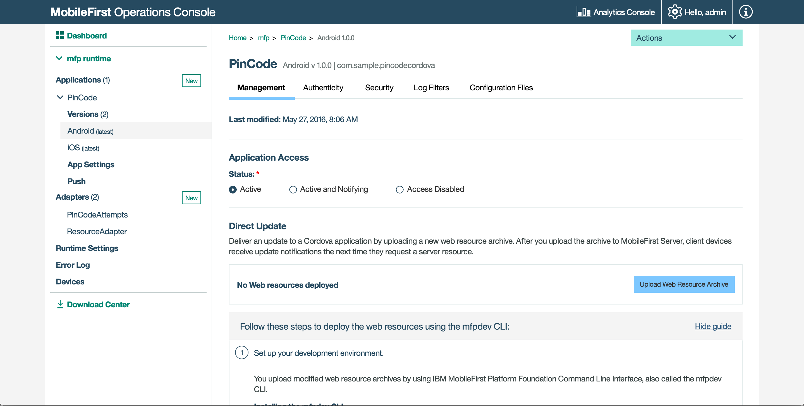

---

copyright:
  years: 2020
lastupdated: "2020-04-29"

keywords: update web content in apps, update apps, web content in mobile app, mobile app development, upload web resources file, packaged web resources

subcollection:  mobilefoundation-sw

---

{:external: target="_blank" .external}
{:shortdesc: .shortdesc}
{:codeblock: .codeblock}
{:pre: .pre}
{:screen: .screen}
{:tsSymptoms: .tsSymptoms}
{:tsCauses: .tsCauses}
{:tsResolve: .tsResolve}
{:tip: .tip}
{:important: .important}
{:note: .note}
{:download: .download}
{:java: .ph data-hd-programlang='java'}
{:ruby: .ph data-hd-programlang='ruby'}
{:c#: .ph data-hd-programlang='c#'}
{:objectc: .ph data-hd-programlang='Objective C'}
{:python: .ph data-hd-programlang='python'}
{:javascript: .ph data-hd-programlang='javascript'}
{:php: .ph data-hd-programlang='PHP'}
{:swift: .ph data-hd-programlang='swift'}
{:reactnative: .ph data-hd-programlang='React Native'}
{:csharp: .ph data-hd-programlang='csharp'}
{:ios: .ph data-hd-programlang='iOS'}
{:android: .ph data-hd-programlang='Android'}
{:cordova: .ph data-hd-programlang='Cordova'}
{:xml: .ph data-hd-programlang='xml'}

# Alternative steps to update web content in app
{: #alternate_steps_to_update_app_web_content_in_app}

Review the following list for the alternative ways to update the web content in your app.

* Build the `.zip` file and upload it to a different {{site.data.keyword.mobilefoundation_short}} server:  `mfpdev app webupdate [server-name] [runtime-name]`. For example,

   ```bash
   mfpdev app webupdate myQAServer MyBankApps
   ```
   {: codeblock}

* Upload a previously generated `.zip` file: `mfpdev app webupdate [server-name] [runtime-name] --file [path-to-packaged-web-resources]`. For example,

   ```bash
   mfpdev app webupdate myQAServer MyBankApps --file mobilefirst/ios/com.mfp.myBankApp-1.0.1.zip
   ```
   {: codeblock}

* Manually upload packaged web resources to the {{site.data.keyword.mobilefoundation_short}} server:

   1. Build the .zip file without uploading it:

      ```bash
      mfpdev app webupdate --build
      ```
      {: pre}

   1. Load the {{site.data.keyword.mobilefoundation_short}} Operations Console and click the application entry.
   1. Click **Upload Web Resources File** to upload the packaged web resources.    
  
      

   Run the command `mfpdev help app webupdate` to learn more.
   {: tip}
