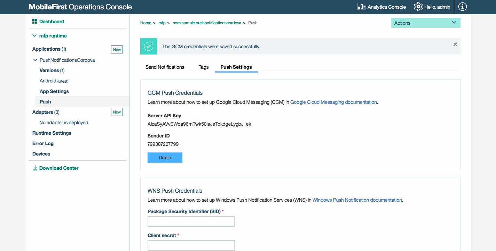
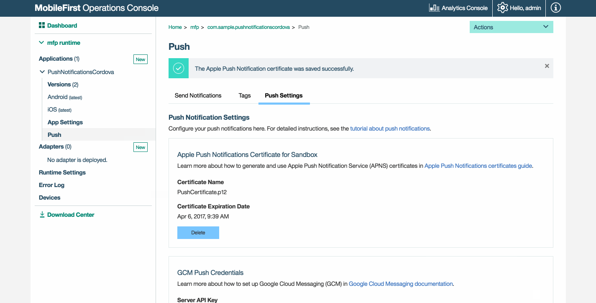
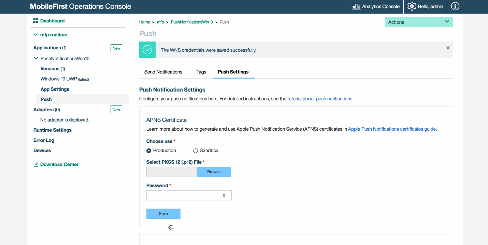
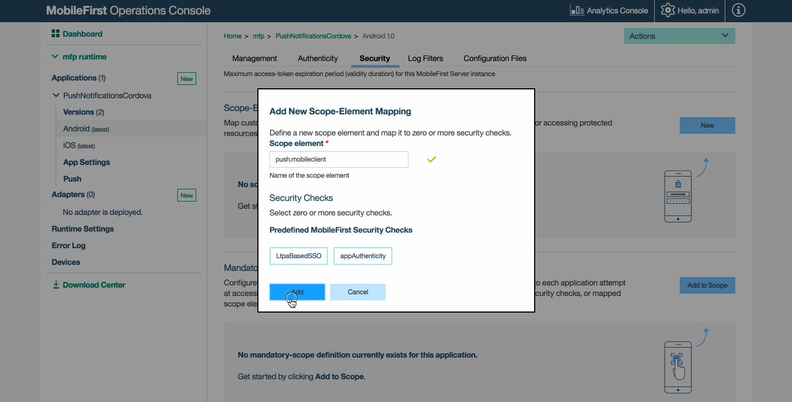
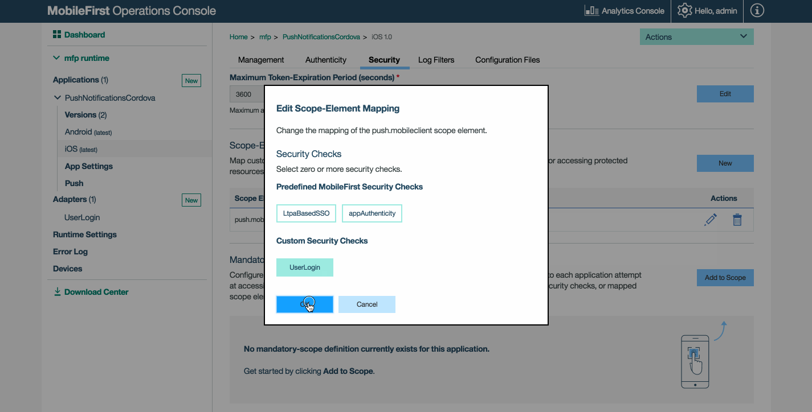
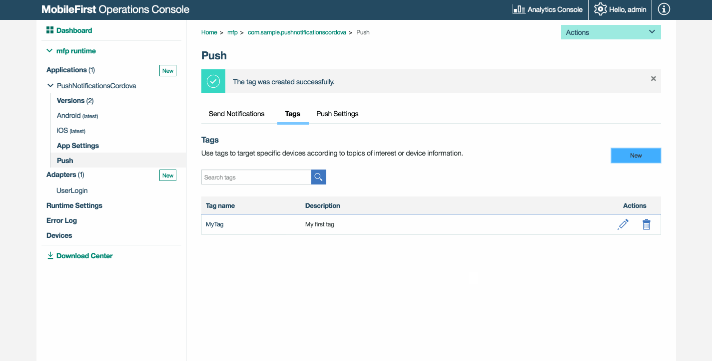

---

copyright:
  years: 2020
lastupdated: "2020-04-29"

keywords: push notifications, notifications, FCM, GCM, APNS, WNS, authenticate notification, firebase push, WNS for Windows, cloud messaging, SMS configuration settings

subcollection:  mobilefoundation-sw

---

{:external: target="_blank" .external}
{:shortdesc: .shortdesc}
{:codeblock: .codeblock}
{:pre: .pre}
{:screen: .screen}
{:tsSymptoms: .tsSymptoms}
{:tsCauses: .tsCauses}
{:tsResolve: .tsResolve}
{:tip: .tip}
{:important: .important}
{:note: .note}
{:download: .download}
{:java: .ph data-hd-programlang='java'}
{:ruby: .ph data-hd-programlang='ruby'}
{:c#: .ph data-hd-programlang='c#'}
{:objectc: .ph data-hd-programlang='Objective C'}
{:python: .ph data-hd-programlang='python'}
{:javascript: .ph data-hd-programlang='javascript'}
{:php: .ph data-hd-programlang='PHP'}
{:swift: .ph data-hd-programlang='swift'}
{:reactnative: .ph data-hd-programlang='React Native'}
{:csharp: .ph data-hd-programlang='csharp'}
{:ios: .ph data-hd-programlang='iOS'}
{:android: .ph data-hd-programlang='Android'}
{:cordova: .ph data-hd-programlang='Cordova'}
{:xml: .ph data-hd-programlang='xml'}

# Configure Push Notifications
{: #configure_push_notifications}

In order to send push notifications to iOS, Android, or Windows devices, the {{site.data.keyword.mfserver_short_notm}} first needs to be configured with the FCM details for Android, an APNS certificate for iOS or WNS credentials for Windows 8.1 Universal / Windows 10 UWP. Microsoft, Windows, Windows NT, and the Windows logo are trademarks of Microsoft Corporation in the United States, other countries, or both.
{: shortdesc}

Notifications can then be sent by using following options:
* all devices (broadcast)
* devices that registered to specific tags
* a single Device ID,
* User Ids
* only iOS devices
* only Android devices
* only Windows devices
* based on the authenticated user.

## Setting up Notifications
{: #setting-up-notifications }

Enabling notifications support involves several configuration steps in both {{site.data.keyword.mfserver_short_notm}} and the client application. Continue reading for the server-side setup, or jump to [Client-side setup](#tutorials-to-follow-next).

On the server-side, required set-up includes: configuring the needed vendor (APNS, FCM or WNS) and mapping the `push.mobileclient` scope.

### Firebase Cloud Messaging
{: #firebase-cloud-messaging }

Google [deprecated GCM](https://developers.google.com/cloud-messaging/faq){: external} and has integrated Cloud Messaging with Firebase. If you are using a GCM project, ensure that you [migrate the GCM client apps on Android to FCM](https://developers.google.com/cloud-messaging/android/android-migrate-fcm){: external}.
{: note}

Android devices use the Firebase Cloud Messaging (FCM) service for push notifications.

To set up FCM:

1. Visit the [Firebase Console](https://console.firebase.google.com/?pli=1).
1. Create a project and provide a project name.
1. Click the Settings "cog wheel" icon and select **Project settings**.
1. Click the **Cloud Messaging** tab to generate a **Server API Key** and a **Sender ID** and click **Save**.

You can also set up FCM by using either the [REST API for the {{ site.data.keyword.mobilefirst_notm }} Push service](http://www.ibm.com/support/knowledgecenter/en/SSHS8R_8.0.0/com.ibm.worklight.apiref.doc/rest_runtime/r_restapi_push_gcm_settings_put.html#Push-GCM-Settings--PUT-) or the [REST API for the {{ site.data.keyword.mobilefirst_notm }} administration service](http://www.ibm.com/support/knowledgecenter/en/SSHS8R_8.0.0/com.ibm.worklight.apiref.doc/apiref/r_restapi_update_gcm_settings_put.html#restservicesapi).
{: note}

If your organization has a firewall that restricts the traffic to or from the internet, you must go through the following steps:  
* Configure the firewall to allow connectivity with FCM in order for your FCM client apps to receive messages.
* The ports to open are 5228, 5229, and 5230. FCM typically uses only 5228, but it sometimes uses 5229 and 5230.
* FCM does not provide specific IP, so you must allow your firewall to accept outgoing connections to all IP addresses contained in the IP blocks listed in Google’s ASN of 15169.
* Ensure that your firewall accepts outgoing connections from {{ site.data.keyword.mfserver_short_notm }} to fcm.googleapis.com on port 443.
{: note }

### Apple Push Notifications Service
{: #apple-push-notifications-service }

iOS devices use Apple's Push Notification Service (APNS) for push notifications.  

To set up APNS:

1. Generate a push notification certificate for development or production. For detailed steps, refer the `For iOS` section [here](https://cloud.ibm.com/docs/services/mobilepush?topic=mobile-pushnotification-push_step_1#push_step_1).
1. In the {{ site.data.keyword.mfp_oc_short_notm }} → **[your application] → Push → Push Settings**, select the certificate type and provide the certificate's file and password. Then, click **Save**.

   * For push notifications to be sent, the following servers must be accessible from a {{ site.data.keyword.mfserver_short_notm }} instance,
      * Sandbox servers:
         * gateway.sandbox.push.apple.com:2195
         * feedback.sandbox.push.apple.com:2196
      * Production servers:
         * gateway.push.apple.com:2195
         * Feedback.push.apple.com:2196
         * 1-courier.push.apple.com 5223
   * During the development phase, use the apns-certificate-sandbox.p12 sandbox certificate file.
   * During the production phase, use the apns-certificate-production.p12 production certificate file.

      * The APNS production certificate can be tested only when the application that uses it is successfully submitted to the Apple App Store.
      {: note }

MobileFirst does not support Universal certificates.
{: note }

You can also set up APNS by using either the [REST API for the {{ site.data.keyword.mobilefirst_notm }} Push service](http://www.ibm.com/support/knowledgecenter/en/SSHS8R_8.0.0/com.ibm.worklight.apiref.doc/rest_runtime/r_restapi_push_apns_settings_put.html#Push-APNS-settings--PUT-) or the [REST API for the {{ site.data.keyword.mobilefirst_notm }} administration service](http://www.ibm.com/support/knowledgecenter/en/SSHS8R_8.0.0/com.ibm.worklight.apiref.doc/apiref/r_restapi_update_apns_settings_put.html?view=kc).
{: note}

### Windows&trade; Push Notifications Service
{: #windows-push-notifications-service }

Windows&trade; devices use the Windows&trade; Push Notifications Service (WNS) for push notifications.  

To set up WNS:

1. Follow the [instructions provided by Microsoft&trade;](https://msdn.microsoft.com/en-in/library/windows/apps/hh465407.aspx) to generate the **Package Security Identifier (SID)** and **Client secret** values.
1. In the {{ site.data.keyword.mfp_oc_short_notm }} → **[your application] → Push → Push Settings**, add these values and click **Save**.

You can also set up WNS by using either the [REST API for the {{ site.data.keyword.mobilefirst_notm }} Push service](http://www.ibm.com/support/knowledgecenter/en/SSHS8R_8.0.0/com.ibm.worklight.apiref.doc/rest_runtime/r_restapi_push_wns_settings_put.html?view=kc) or the [REST API for the {{ site.data.keyword.mobilefirst_notm }} administration service](http://www.ibm.com/support/knowledgecenter/en/SSHS8R_8.0.0/com.ibm.worklight.apiref.doc/apiref/r_restapi_update_wns_settings_put.html?view=kc)

### Scope mapping
{: #scope-mapping }

Map the **push.mobileclient** scope element to the application.

1. Load the {{ site.data.keyword.mfp_oc_short_notm }} and navigate to **[your application] → Security → Scope-Elements Mapping**, click **New**.
1. Write "push.mobileclient" in the **Scope element** field. Then, click **Add**.

List of more available scopes:

|**Scopes** | **Description**|
|---|---|
|apps.read | Permission to read application resource. |
|apps.write | Permission to create, update, delete application resource. |
|gcmConf.read | Permission to read GCM configuration settings (API Key and SenderId). |
|gcmConf.write | Permission to update, delete GCM configuration settings. |
|apnsConf.read | Permission to read APNs configuration settings. |
|apnsConf.write | Permission to update, delete APNs configuration settings. |
|devices.read | Permission to read device. |
|devices.write | Permission to create, update delete device. |
|subscriptions.read | Permission to read subscriptions. |
|subscriptions.write | Permission to create, update, delete subscriptions. |
|messages.write | Permission to send push notifications. |
|webhooks.read | Permission to read event-notifications. |
|webhooks.write | Permission to send event-notifications.|
|smsConf.read | Permission to read SMS configuration settings.|
|smsConf.write | Permission to update, delete SMS configuration settings.|
|wnsConf.read | Permission to read WNS configuration settings.|
|wnsConf.write | Permission to update, delete WNS configuration settings.|
{: caption="Table 1. Scope descriptions" caption-side="top"}

### Authenticated Notifications
{: #authenticated-notifications }

Authenticated notifications are notifications that are sent to one or more `userIds`.  

Map the **push.mobileclient** scope element to the security check used for the application.  

1. Load the {{ site.data.keyword.mfp_oc_short_notm }} and navigate to **[your application] → Security → Scope-Elements Mapping**, click **New** or edit an existing scope-mapping entry.
1. Select a security check. Then, click **Add**.

   

## Defining Tags
{: #defining-tags }

* In the {{ site.data.keyword.mfp_oc_short_notm }} → **[your application] → Push → Tags**, click **New**.  
* Provide the appropriate `Tag Name` and `Description` and click **Save**.

   

Subscriptions tie together a device registration and a tag. When a device is unregistered from a tag, all associated subscriptions are automatically unsubscribed from the device itself. In a scenario where multiple users of a device exist, subscriptions must be implemented in mobile applications based on user log-in criteria. For example, the subscribe call is made after a user successfully logs in to an application and the unsubscribe call is made explicitly as part of the logout action handling.

## Tutorials to follow next
{: #tutorials-to-follow-next }

* [Send Push Notifications](/docs/mobilefoundation-sw?topic=mobilefoundation-sw-send_push_notifications#send_push_notifications)

With the server-side now set up, set up the client-side and handle received notifications.

