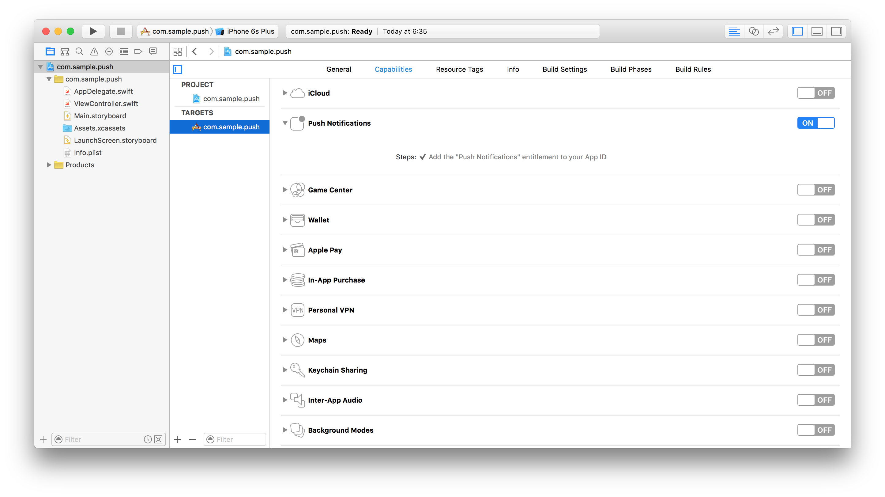

---

copyright:
  years: 2020
lastupdated: "2020-04-29"

keywords: push notifications, notifications, set up windows app for notification

subcollection:  mobilefoundation-sw

---

{:external: target="_blank" .external}
{:shortdesc: .shortdesc}
{:codeblock: .codeblock}
{:pre: .pre}
{:term: .term}
{:screen: .screen}
{:tip: .tip}
{:important: .important}
{:note: .note}
{:download: .download}
{:external: target="_blank" .external}

# Receive {{site.data.keyword.mobilepushshort}}
{: #receiving_push_notifications_in_cordova}

For Cordova-based applications to be able to receive and display incoming push notifications the application must first be configured.
{: shortdesc}

## Handling Push Notifications in Cordova
{: #handling_push_notifications_in_cordova}

Before iOS, Android and Windows&trade Cordova applications are able to receive and display push notifications, the **cordova-plugin-mfp-push** Cordova plug-in needs to be added to the Cordova project. Microsoft, Windows, Windows NT, and the Windows logo are trademarks of Microsoft Corporation in the United States, other countries, or both. After an application is configured, {{ site.data.keyword.mobilefirst_notm }}-provided Notifications API can be used to register &amp; unregister devices, subscribe &amp; unsubscribe tags and handle notifications. In this tutorial, you learn how to handle push notification in Cordova applications.

Authenticated notifications are currently **not supported** in Cordova applications due to a defect. However, a workaround is provided: each `MFPPush` API call can be wrapped by `WLAuthorizationManager.obtainAccessToken("push.mobileclient").then( ... );`.
{: note}

For information about Silent or Interactive notifications in iOS, see the following:

* [Silent Notifications](/docs/mobilefoundation-sw?topic=mobilefoundation-sw-silent_notifications#silent_notifications)
* [Interactive Notifications](/docs/mobilefoundation-sw?topic=mobilefoundation-sw-interactive_notifications#interactive_notifications)

### Prerequisites
{: #prereqs-cordova}

* {{site.data.keyword.mfserver_short}} to run locally, or a remotely running {{site.data.keyword.mfserver_short}}
* {{site.data.keyword.mfp_cli_long_notm}} installed on the developer workstation
* Cordova [CLI](#x2008863){: term} installed on the developer workstation

### Notifications Configuration
{: #notifications-configuration-cordova}

Create a Cordova project or use an existing one, and add one or more of the supported platforms: iOS, Android, Windows.

If the {{site.data.keyword.mobilefirst_notm}} Cordova SDK is not already present in the project, follow the instructions in the [Adding the {{site.data.keyword.mobilefirst_notm}} SDK to Cordova applications](/docs/mobilefoundation-sw/add_sdk_to_cordova_app.html#add_sdk_to_cordova_app) tutorial.
{: note}

### Adding the Push plug-in
{: #adding-the-push-plug-in-cordova}

1. From a **command-line** window, navigate to the root of the Cordova project.  
1. Add the push plug-in to by running the command:

   ```bash
   cordova plugin add cordova-plugin-mfp-push
   ```
   {: codeblock}

1. Build the Cordova project by running the command:

   ```bash
   cordova build
   ```
   {: codeblock}

### iOS platform
{: #ios-platform}

The iOS platform requires an extra step.  

In Xcode, enable push notifications for your application in the **Capabilities** screen.

The bundleId selected for the application must match the AppId that you previously created in the Apple Developer site.
{: important}



### Android platform
{: #android-platform}

The Android platform requires an extra step.  

In Android Studio, add the following `activity` to the `application` tag:

```xml
<activity android:name="com.ibm.mobilefirstplatform.clientsdk.android.push.api.MFPPushNotificationHandler" android:theme="@android:style/Theme.NoDisplay"/>
```
{: codeblock}

### Notifications API
{: #notifications-api-cordova}

#### Client-side
{: #client-side-cordova}

| JavaScript Function | Description |
| --- | --- |
| [`MFPPush.initialize(success, failure)`](#initialization-cordova) | Initialize the MFPPush instance. |
| [`MFPPush.isPushSupported(success, failure)`](#is-push-supported-cordova) | Does the device support push notifications. |
| [`MFPPush.registerDevice(options, success, failure)`](#register-device-cordova) | Registers the device with the Push Notifications Service. |
| [`MFPPush.getTags(success, failure)`](#get-tags-cordova) | Retrieves all the tags available in a push notification service instance. |
| [`MFPPush.subscribe(tag, success, failure)`](#subscribe-cordova) | Subscribes to a particular tag. |
| [`MFPPush.getSubsciptions(success, failure)`](#get-subscriptions-cordova) | Retrieves the tags device is subscribed to |
| [`MFPPush.unsubscribe(tag, success, failure)`](#unsubscribe-cordova) | Unsubscribes from a particular tag. |
| [`MFPPush.unregisterDevice(success, failure)`](#unregister-cordova) | Unregisters the device from the Push Notifications Service |
{: caption="Table 3. Javascript functions" caption-side="top"}

#### API implementation
{: #api-implementation}

##### Initialization
{: #initialization-cordova}

Initialize the **MFPPush** instance.

- Required for the client application to connect to MFPPush service with the correct application context.  
- The API method should be called first before you use any other MFPPush APIs.
- Registers the callback function to handle received push notifications.

```javascript
MFPPush.initialize (
    function(successResponse) {
        alert("Successfully intialized");
        MFPPush.registerNotificationsCallback(notificationReceived);
    },
    function(failureResponse) {
        alert("Failed to initialize");
    }
);
```
{: codeblock}

##### Is push supported
{: #is-push-supported-cordova}

Check whether the device supports push notifications.

```javascript
MFPPush.isPushSupported (
    function(successResponse) {
        alert("Push Supported: " + successResponse);
    },
    function(failureResponse) {
        alert("Failed to get push support status");
    }
);
```
{: codeblock}

##### Register device
{: #register-device-cordova}

Register the device to the {{site.data.keyword.mobilepushshort}} service. If no options are required, options can be set to `null`.

```javascript
var options = { };
MFPPush.registerDevice(
    options,
    function(successResponse) {
        alert("Successfully registered");
    },
    function(failureResponse) {
        alert("Failed to register");
    }
);
```
{: codeblock}

##### Get tags
{: #get-tags-cordova}

Retrieve all the available tags from the push notification service.

```javascript
MFPPush.getTags (
    function(tags) {
        alert(JSON.stringify(tags));
},
    function() {
        alert("Failed to get tags");
    }
);
```
{: codeblock}

##### Subscribe
{: #subscribe-cordova}

Subscribe to desired tags.

```javascript
var tags = ['sample-tag1','sample-tag2'];

MFPPush.subscribe(
    tags,
    function(tags) {
        alert("Subscribed successfully");
    },
    function() {
        alert("Failed to subscribe");
    }
);
```
{: codeblock}

##### Get subscriptions
{: #get-subscriptions-cordova}

Retrieve tags the device is subscribed to.

```javascript
MFPPush.getSubscriptions (
    function(subscriptions) {
        alert(JSON.stringify(subscriptions));
    },
    function() {
        alert("Failed to get subscriptions");
    }
);
```
{: codeblock}

##### Unsubscribe
{: #unsubscribe-cordova}

Unsubscribe from tags.

```javascript
var tags = ['sample-tag1','sample-tag2'];

MFPPush.unsubscribe(
    tags,
    function(tags) {
        alert("Unsubscribed successfully");
    },
    function() {
        alert("Failed to unsubscribe");
    }
);
```
{: codeblock}

##### Unregister
{: #unregister-cordova}

Unregister the device from push notification service instance.

```javascript
MFPPush.unregisterDevice(
    function(successResponse) {
        alert("Unregistered successfully");
    },
    function() {
        alert("Failed to unregister");
    }
);
```
{: codeblock}

### Handling a push notification
{: #handling-a-push-notification-cordova}

You can handle a received push notification by operating on its response object in the registered callback function.

```javascript
var notificationReceived = function(message) {
    alert(JSON.stringify(message));
};
```
{: codeblock}

## Next steps
{: #next-steps-cordova-push}

* [Configure offline storage](/docs/mobilefoundation-sw?topic=mobilefoundation-sw-configure_offline_storage_cordova).
* [Add {{site.data.keyword.mobilefoundation_short}} Analytics](/docs/mobilefoundation-sw?topic=mobilefoundation-sw-instrument_your_app_cordova).
* [Send in-app feedback](/docs/mobilefoundation-sw?topic=mobilefoundation-sw-sending_in_app_user_feedback_cordova).

For more information about Push Notifications, see [here](/docs/mobilefoundation-sw?topic=mobilefoundation-sw-push_notifications).
{: note}
