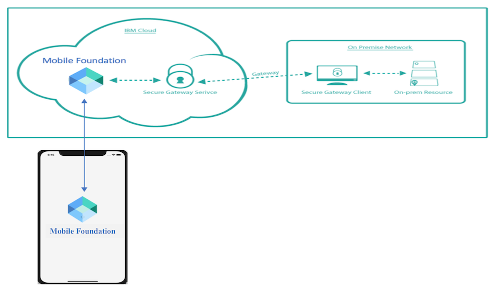
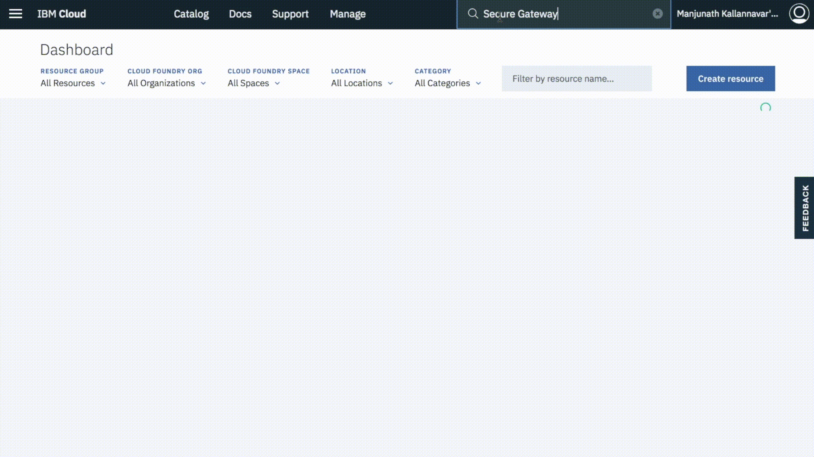
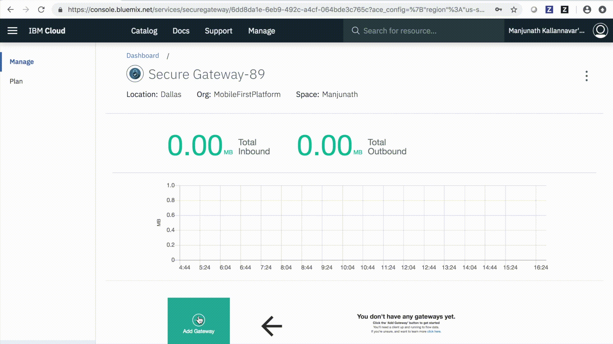
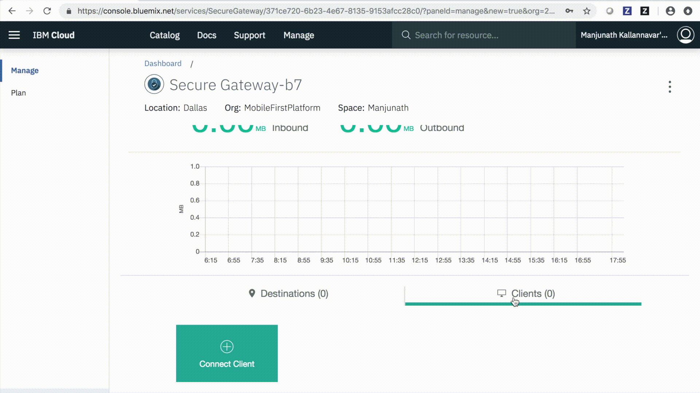
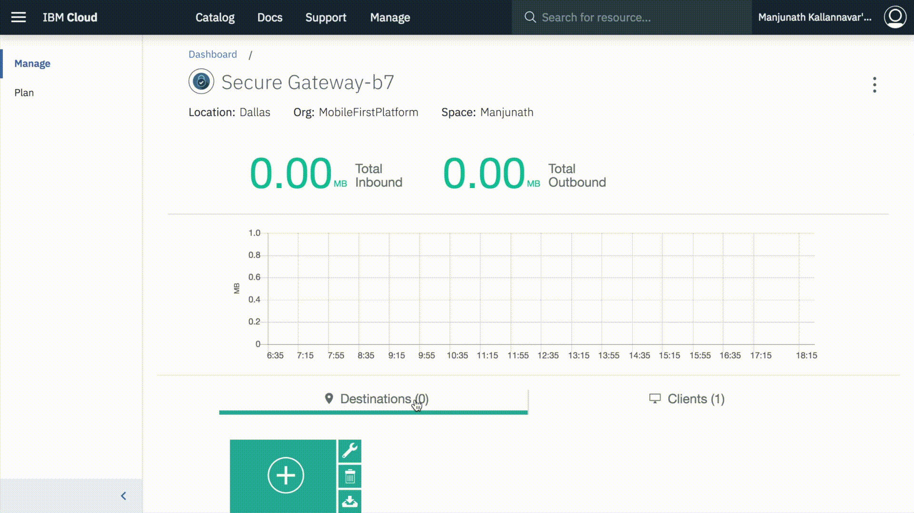
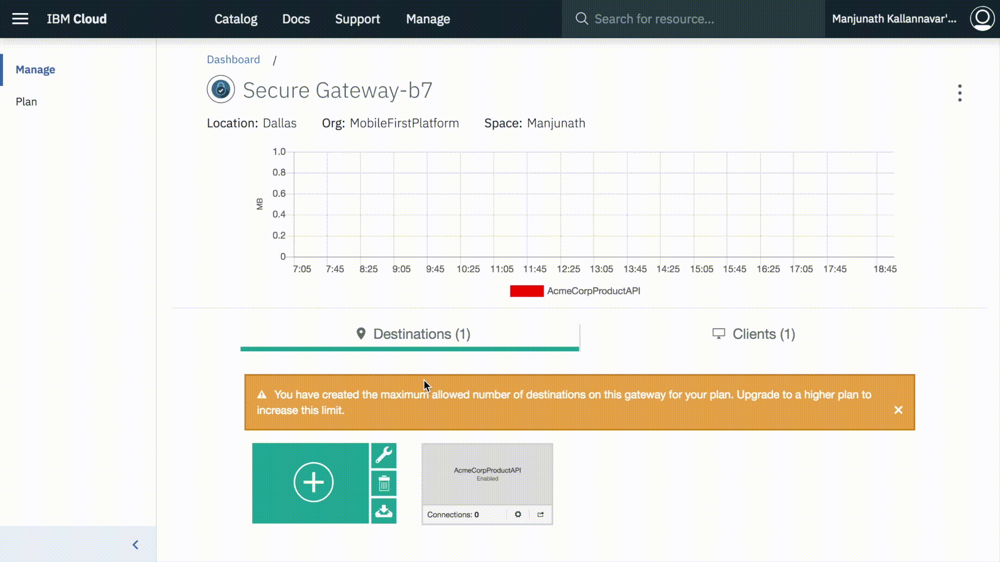
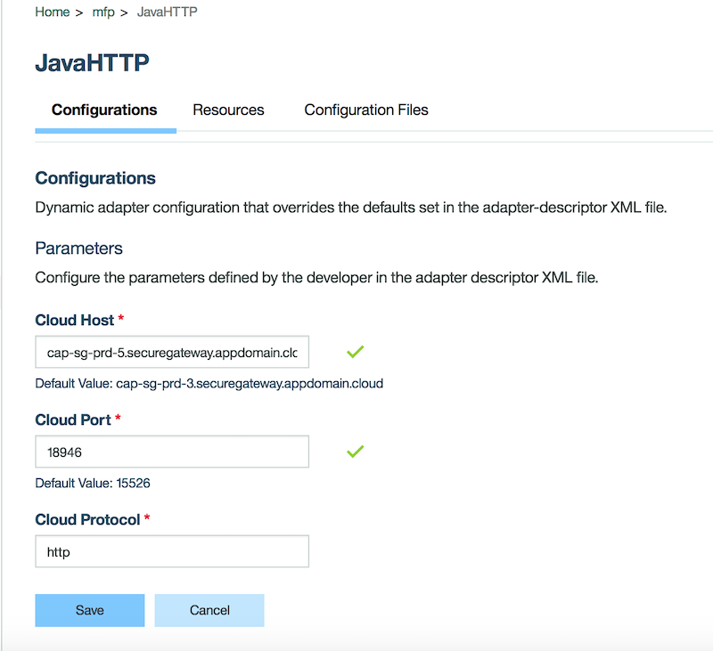
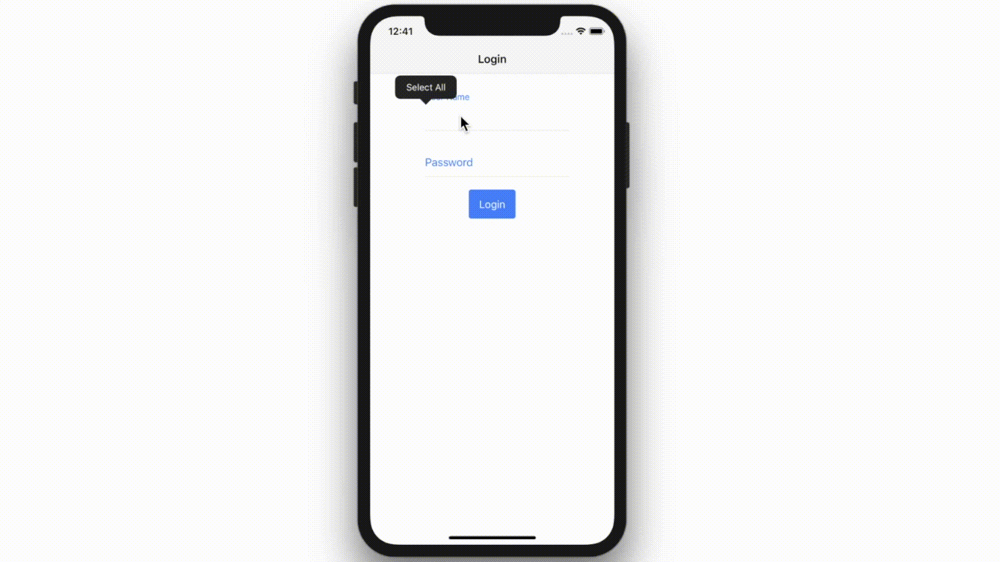

---

copyright:
  years: 2020
lastupdated: "2020-04-29"

keywords: integration, {{site.data.keyword.mobilefoundation_short}}, secure gateway

subcollection:  mobilefoundation-sw

---

{:external: target="_blank" .external}
{:shortdesc: .shortdesc}
{:codeblock: .codeblock}
{:pre: .pre}
{:term: .term}
{:screen: .screen}
{:tsSymptoms: .tsSymptoms}
{:tsCauses: .tsCauses}
{:tsResolve: .tsResolve}
{:tip: .tip}
{:important: .important}
{:note: .note}
{:download: .download}
{:java: .ph data-hd-programlang='java'}
{:ruby: .ph data-hd-programlang='ruby'}
{:c#: .ph data-hd-programlang='c#'}
{:objectc: .ph data-hd-programlang='Objective C'}
{:python: .ph data-hd-programlang='python'}
{:javascript: .ph data-hd-programlang='javascript'}
{:php: .ph data-hd-programlang='PHP'}
{:swift: .ph data-hd-programlang='swift'}
{:reactnative: .ph data-hd-programlang='React Native'}
{:csharp: .ph data-hd-programlang='csharp'}
{:ios: .ph data-hd-programlang='iOS'}
{:android: .ph data-hd-programlang='Android'}
{:cordova: .ph data-hd-programlang='Cordova'}
{:xml: .ph data-hd-programlang='xml'}

# Establishing a secure connection to an on-premises system that uses the Secure Gateway service
{: #integrate_secure_gateway}

When you build enterprise mobile apps, you often want to integrate your apps with existing systems of record. To access and use data that is stored in your [on-premises](#x4561212){: term} data center from a mobile app, you can use {{site.data.keyword.mobilefoundation_short}} with the [Secure Gateway service](https://cloud.ibm.com/catalog/services/secure-gateway) on [{{site.data.keyword.cloud_notm}}](https://cloud.ibm.com/). Secure Gateway service provides quick, easy, and secure connectivity and establishes a tunnel between the {{site.data.keyword.cloud_notm}} and the remote system that you want to connect to.

This tutorial explains how to access HTTP endpoints in your on-premises data center from {{site.data.keyword.mobilefoundation_short}} adapters that are running on {{site.data.keyword.cloud_notm}} by using Secure Gateway service.

## Prerequisite
{: #prereq_int_sec_gw}

To complete this tutorial, you need an HTTP endpoint within your enterprise firewall that exposes the systems of record data. Alternatively, create a test endpoint in your local environment by using [this sample](https://github.com/MobileFirst-Platform-Developer-Center/MFPSecureGatewayIonic/tree/master/NodeJSHTTPProject){: external} `Node.js` project.

Navigate to the project folder and run your HTTP server.

```bash
npm install
node app.js
```
{: codeblock}

## Integration scenario with Secure Gateway service
{: #secure_gateway}

The following image illustrates the architecture that is used in the integration scenario that is explained in this tutorial.



## Implementing the Secure Gateway integration
{: #implementing_sg_integration}

### Create a Secure Gateway service instance
Log in to {{site.data.keyword.cloud_notm}} and create an instance of the [Secure Gateway service](https://cloud.ibm.com/catalog/services/secure-gateway/).



After the Secure Gateway service instance is created, use the following steps to configure the Secure Gateway service between {{site.data.keyword.cloud_notm}} and your on-premises environment.

### Add a Gateway
{: #add_gateway}

In the Secure Gateway service dashboard, click **Add Gateway** to create a new gateway by providing any wanted gateway name.



### Add a Secure Gateway client
{: #add_sg_client}



From within your new gateway from the **Clients** tab, click **Connect Client**.

You can use any of the clients of your choice and run the Secure Gateway client on your on-premises environment. The steps to set up the Secure Gateway client are available in the Secure Gateway console.

In this tutorial, Docker container option is used to run the Secure Gateway client.
Use the following steps:
* Install Docker on your on-premises machine, if it is not already installed.
* Start a terminal session and run the Secure Gateway client on a container by using the command that is shown in the service console.

   ```bash
   docker run –it ibmcom/secure-gateway-client <gatewayId>
   ```
   {: codeblock}

   `gatewayId` can be found in the console as shown in the previous image.

### Add a destination
{: #add_destination}



From within your new gateway from the **Destinations** tab, click **Add Destination**.

Secure Gateway service allows you to either connect to an on-premises endpoint from {{site.data.keyword.cloud_notm}} environment or connect from an on-premises environment to a cloud resource. For this scenario, select on-premises as the resource location and provide hostname / IP and port of the on-premises resource. Also, provide a destination name of your choice.

To enable the request to be forwarded from the Secure Gateway client to the resource endpoint, you would need to add the resource to the access list.
Run the following command on the terminal of the Secure Gateway client (running as container on Docker runtime, in this scenario) to add the resource to access list.

```
acl allow <resourceHost>:<resourcePort>
```
{: codeblock}

`resourceHost` and `resourcePort` refers to the details of the on-premises resource endpoint.

The destination is now configured. Secure Gateway service populates cloud host and port details, which can be used to access the on-premises resource from the cloud environment.



### Configuring Secure Gateway service with {{site.data.keyword.mobilefoundation_short}} and {{site.data.keyword.mobilefoundation_short}} adapter
{: #configuration_sg_mfp}

In this tutorial, {{site.data.keyword.mobilefoundation_short}} service instance on {{site.data.keyword.cloud_notm}} is used to configure the {{site.data.keyword.mobilefoundation_short}} server. The {{site.data.keyword.mobilefoundation_short}} service on {{site.data.keyword.cloud_notm}} helps to provision the {{site.data.keyword.mobilefoundation_short}} server on Liberty runtime as a Cloud foundry application. The {{site.data.keyword.mobilefoundation_short}} service enables you to take any {{site.data.keyword.mobilefoundation_short}} project that is developed on a local environment and run it on {{site.data.keyword.cloud_notm}}.

### {{site.data.keyword.mobilefoundation_short}} server setup on {{site.data.keyword.cloud_notm}}
{: #mf_server_setup}

Create an instance of the [{{site.data.keyword.mobilefoundation_short}} service](https://cloud.ibm.com/catalog/services/mobile-foundation), from the {{site.data.keyword.cloud_notm}} console.

From the {{site.data.keyword.mobilefoundation_short}} service console, create the [{{site.data.keyword.mobilefoundation_short}} server](https://mobilefirstplatform.ibmcloud.com/tutorials/en/foundation/8.0/ibmcloud/using-mobile-foundation/){: external}.

### Building and deploying {{site.data.keyword.mobilefoundation_short}} adapter
{: #deploying_mf_adapter}

In this tutorial, connection to the Secure Gateway endpoint is done by using a {{site.data.keyword.mobilefoundation_short}} adapter. [Download](https://github.com/MobileFirst-Platform-Developer-Center/Adapters/tree/release80/JavaHTTP){: external} the {{site.data.keyword.mobilefoundation_short}} JavaHTTP adapter.

Build and deploy the adapter in {{site.data.keyword.mobilefoundation_short}} Operations console by using [mfpdev-cli](/docs/mobilefoundation-sw?topic=mobilefoundation-sw-mobile_foundation_cli#mobile_foundation_cli) commands.
```bash
mfpdev adapter build
mfpdev adapter deploy
```
{: codeblock}

Learn about building and deploying adapters from [here](https://mobilefirstplatform.ibmcloud.com/tutorials/en/foundation/8.0/adapters/){: external}.
{: tip}

Provide the cloud host and port details for the resource endpoint in the JavaHTTP adapter, got from the previous section.



Where `cap-sg-prd-5.securegateway.appdomain.cloud` and `18946` are Secure Gateway host and port.

The {{site.data.keyword.mobilefoundation_short}} adapter is now configured and the {{site.data.keyword.mobilefoundation_short}} service is now enabled to work with an on-premises system within the enterprise by using the Secure Gateway service.

### Creating and registering {{site.data.keyword.mobilefoundation_short}} sample app
{: #registering_sample_app}

Download the {{site.data.keyword.mobilefoundation_short}} sample app from [here](https://github.com/MobileFirst-Platform-Developer-Center/MFPSecureGatewayIonic/){: external}, follow the instructions, under the `Readme`, and register the app in the {{site.data.keyword.mobilefoundation_short}} Operations console.

Run the app, provide credentials to log in, and click the *Login*. Click *Fetch Acme Writers* to call your on-premises endpoint through Secure Gateway by using the JavaHTTP adapter deployed in your {{site.data.keyword.mobilefoundation_short}} Operations console. Receive the wanted data from the on-premises environment.



You can connect to multiple on-premises endpoints by configuring multiple destinations on the Secure Gateway service and by deploying {{site.data.keyword.mobilefoundation_short}} adapters to connect to the respective cloud host of the endpoint. You can also configure the Secure Gateway service with extra security to ensure that the communication to the endpoint happens over [HTTPS](#x2193603){: term} and application-side security. You can find the [details here](/docs/SecureGateway?topic=securegateway-getting-started-with-sg#getting-started-with-sg).

## Summary
{: #summary_int_sec_gw}

Using this tutorial that you should be able to establish a secure connection between the {{site.data.keyword.mobilefoundation_short}} adapters that are running on {{site.data.keyword.cloud_notm}} and an on-premises HTTP endpoint, by using the Secure Gateway service.
