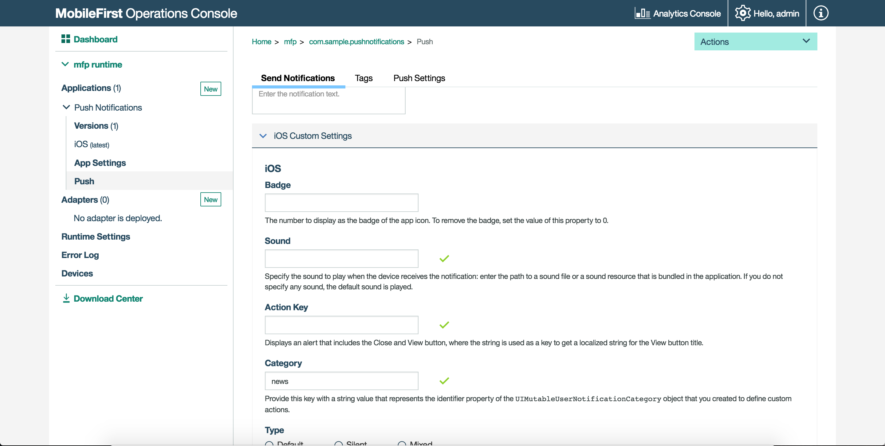

---

copyright:
  years: 2020
lastupdated: "2020-04-29"

keywords: push notifications, sending interactive notification

subcollection:  mobilefoundation-sw

---

{:external: target="_blank" .external}
{:shortdesc: .shortdesc}
{:codeblock: .codeblock}
{:pre: .pre}
{:screen: .screen}
{:tsSymptoms: .tsSymptoms}
{:tsCauses: .tsCauses}
{:tsResolve: .tsResolve}
{:tip: .tip}
{:important: .important}
{:note: .note}
{:download: .download}
{:java: .ph data-hd-programlang='java'}
{:ruby: .ph data-hd-programlang='ruby'}
{:c#: .ph data-hd-programlang='c#'}
{:objectc: .ph data-hd-programlang='Objective C'}
{:python: .ph data-hd-programlang='python'}
{:javascript: .ph data-hd-programlang='javascript'}
{:php: .ph data-hd-programlang='PHP'}
{:swift: .ph data-hd-programlang='swift'}
{:reactnative: .ph data-hd-programlang='React Native'}
{:csharp: .ph data-hd-programlang='csharp'}
{:ios: .ph data-hd-programlang='iOS'}
{:android: .ph data-hd-programlang='Android'}
{:cordova: .ph data-hd-programlang='Cordova'}
{:xml: .ph data-hd-programlang='xml'}

# Interactive Notifications
{: #interactive_notifications}

With interactive notification, when a notification arrives, users can act on the notification without opening the application. When an interactive notification arrives, the device shows action buttons along with the notification message.
{: shortdesc}

Interactive notifications are supported on devices with iOS version 8 and higher. If an interactive notification is sent to an iOS device with version earlier than 8, the notification actions are not displayed.

## Sending interactive push notification
{: #sending-interactive-push-notification}

Prepare the notification and send notification. For more information, see [Sending push notifications](/docs/mobilefoundation-sw?topic=mobilefoundation-sw-send_push_notifications#send_push_notifications).

You can set a string to indicate the category of the notification with the notification object, under **{{ site.data.keyword.mfp_oc_short_notm }} → [your application] → Push → Send Notifications → iOS custom settings**. Based on the category value, the notification action buttons are displayed. For example,



## Handling interactive push notifications in Cordova applications
{: #handling-interactive-push-notifications-in-cordova-applications}

To receive interactive notifications, follow these steps:

1. In the main JavaScript, define the registered categories for interactive notification and pass it to device register call `MFPPush.registerDevice`.

   ```javascript
   var options = {
        ios: {
            alert: true,
            badge: true,
            sound: true,     
            categories: [{
                //Category identifier, this is used while sending the notification.
                id : "poll",

                //Optional array of actions to show the action buttons along with the message.    
                actions: [{
                    //Action identifier
                    id: "poll_ok",

                    //Action title to be displayed as part of the notification button.
                    title: "OK",

                    //Optional mode to run the action in foreground or background. 1-foreground. 0-background. Default is foreground.
                    mode: 1,  

                    //Optional property to mark the action button in red color. Default is false.
                    destructive: false,

                    //Optional property to set if authentication is required or not before running the action.(Screen lock).
                    //For foreground, this property is always true.
                    authenticationRequired: true
                },
                {
                    id: "poll_nok",
                    title: "NOK",
                    mode: 1,
                    destructive: false,
                    authenticationRequired: true
                }],

                //Optional list of actions that is needed to show in the case alert.
                //If it is not specified, then the first four actions will be shown.
                defaultContextActions: ['poll_ok','poll_nok'],

                //Optional list of actions that is needed to show in the notification center, lock screen.
                //If it is not specified, then the first two actions will be shown.
                minimalContextActions: ['poll_ok','poll_nok']
            }]     
        }
   }
   ```
   {: codeblock}

1. Pass the `options` object while you register your device for push notifications.

   ```javascript
   MFPPush.registerDevice(options, function(successResponse) {
  		navigator.notification.alert("Successfully registered");
  		enableButtons();
   });  
   ```
   {: codeblock}

## Handling interactive push notifications in native iOS applications
{: #handling-interactive-push-notifications-in-native-ios-applications}

Follow these steps to receive interactive notifications:

1. Enable the application capability to perform background tasks on receiving the remote notifications. This step is required if some of the actions are enabled at the background.
1. Define registered categories for interactive notifications and pass them as options to `MFPPush.registerDevice`.

   ```swift
   //define categories for Interactive Push
   let acceptAction = UIMutableUserNotificationAction()
   acceptAction.identifier = "OK"
   acceptAction.title = "OK"
   acceptAction.activationMode = .Foreground

   let rejetAction = UIMutableUserNotificationAction()
   rejetAction.identifier = "Cancel"
   rejetAction.title = "Cancel"
   rejetAction.activationMode = .Foreground

   let category = UIMutableUserNotificationCategory()
   category.identifier = "poll"
   category.setActions([acceptAction, rejetAction], forContext: .Default)

   let categories:Set<UIUserNotificationCategory> = [category]

   let options = ["alert":true, "badge":true, "sound":true, "categories": categories]

   // Register device
    MFPPush.sharedInstance().registerDevice(options as [NSObject : AnyObject], completionHandler: {(response: WLResponse!, error: NSError!) -> Void in
   ```
   {: codeblock}
   