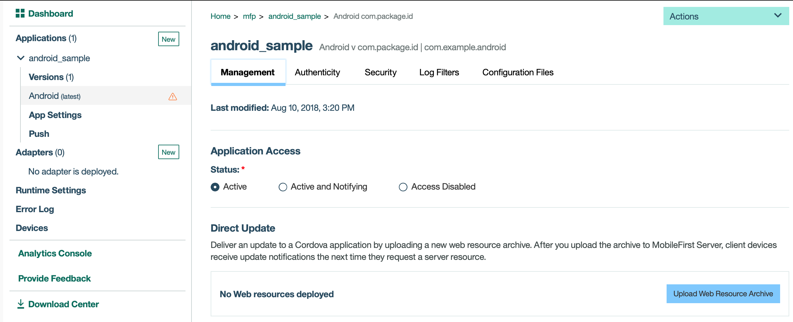

---

copyright:
  years: 2020
lastupdated: "2020-04-29"

keywords: app versions, disabling apps

subcollection:  mobilefoundation-sw

---

{:external: target="_blank" .external}
{:shortdesc: .shortdesc}
{:codeblock: .codeblock}
{:pre: .pre}
{:screen: .screen}
{:tsSymptoms: .tsSymptoms}
{:tsCauses: .tsCauses}
{:tsResolve: .tsResolve}
{:tip: .tip}
{:important: .important}
{:note: .note}
{:download: .download}
{:java: .ph data-hd-programlang='java'}
{:ruby: .ph data-hd-programlang='ruby'}
{:c#: .ph data-hd-programlang='c#'}
{:objectc: .ph data-hd-programlang='Objective C'}
{:python: .ph data-hd-programlang='python'}
{:javascript: .ph data-hd-programlang='javascript'}
{:php: .ph data-hd-programlang='PHP'}
{:swift: .ph data-hd-programlang='swift'}
{:reactnative: .ph data-hd-programlang='React Native'}
{:csharp: .ph data-hd-programlang='csharp'}
{:ios: .ph data-hd-programlang='iOS'}
{:android: .ph data-hd-programlang='Android'}
{:cordova: .ph data-hd-programlang='Cordova'}
{:xml: .ph data-hd-programlang='xml'}
{:help: data-hd-content-type='help'}
{:support: data-reuse='support'}

# Manage app versions
{: #manage_app_versions}
{: help}
{: support}

The {{site.data.keyword.mobilefoundation_short}} application management capabilities provide {{site.data.keyword.mobilefoundation_short}} Server users and administrators with granular control over user and device access to their applications.

{{site.data.keyword.mobilefoundation_short}} server tracks all attempts to access your mobile infrastructure and stores information about the application, the user, and the device on which the application is installed. The mapping between the application, the user, and the device forms the basis for the server’s mobile-application management capabilities.

Using the {{site.data.keyword.mobilefoundation_short}} Operations console, you can monitor and manage access to your resources. You can also manage your specific application version.

1. Go to {{site.data.keyword.mobilefoundation_short}} Operations console, click **Applications**, choose the application that you want to manage, select the specific version of the application you are interested in, from the **Versions** list displayed.
   

1. Under the **Management** tab, you see the options to set the application status for the selected application version. The supported states for an application version are,
   * Active
   * Active and Notifying
   * Access Disabled
1. An application version can be disabled by selecting the *Access Disabled* option, from under **Application Access > Status**.
1. You can also configure to upload the updated web resources for your Cordova application in the **Direct Update** section. Users connecting to {{site.data.keyword.mobilefoundation_short}} server by using this specific application version is then presented the option to update their application by using Direct Update.
1. You can also do the following actions on the selected application version by using the following options in the **Actions** menu:
   * Delete version
   * Clone version
   * Export version

For more information about managing devices, see [Managing devices](/docs/mobilefoundation-sw?topic=mobilefoundation-sw-manage_devices#manage_devices).
For more information about remotely disabling an app version, see [Remotely disable an app version](/docs/mobilefoundation-sw?topic=mobilefoundation-sw-remotely_disable_an_app_version#remotely_disable_an_app_version).
{: note}
