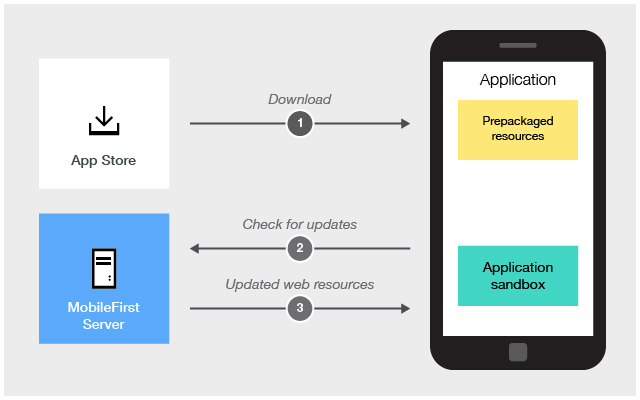

---

copyright:
  years: 2020
lastupdated: "2020-04-29"

keywords: update web content, update apps

subcollection:  mobilefoundation-sw

---

{:external: target="_blank" .external}
{:shortdesc: .shortdesc}
{:codeblock: .codeblock}
{:pre: .pre}
{:term: .term}
{:screen: .screen}
{:tsSymptoms: .tsSymptoms}
{:tsCauses: .tsCauses}
{:tsResolve: .tsResolve}
{:tip: .tip}
{:important: .important}
{:note: .note}
{:download: .download}
{:java: .ph data-hd-programlang='java'}
{:ruby: .ph data-hd-programlang='ruby'}
{:c#: .ph data-hd-programlang='c#'}
{:objectc: .ph data-hd-programlang='Objective C'}
{:python: .ph data-hd-programlang='python'}
{:javascript: .ph data-hd-programlang='javascript'}
{:php: .ph data-hd-programlang='PHP'}
{:swift: .ph data-hd-programlang='swift'}
{:reactnative: .ph data-hd-programlang='React Native'}
{:csharp: .ph data-hd-programlang='csharp'}
{:ios: .ph data-hd-programlang='iOS'}
{:android: .ph data-hd-programlang='Android'}
{:cordova: .ph data-hd-programlang='Cordova'}
{:xml: .ph data-hd-programlang='xml'}

# Direct Update
{: #direct_update}

Web resources (JavaScript, HTML, CSS, or image files) in Cordova or Ionic applications can be updated over-the-air (OTA) with **Direct Update** without the need to go through the App Store or Play Store update. Using the Direct Update feature, businesses can ensure that the users use the latest version of their apps. To update an application, the updated web resources of the application need to be packaged and uploaded to your {{site.data.keyword.mobilefoundation_short}} instance by using the {{site.data.keyword.mobilefoundation_short}} [CLI](#x2008863){: term} or by deploying a generated archive file. Direct Update is then activated automatically. It is then enforced on every user request to a protected resource.



Direct Update is supported in the Cordova iOS and Cordova Android platform.
{: note}

For the live production or pre-production testing phase, it is recommended to implement secure Direct Update before you publish your application to the app store. Secure Direct Update requires an RSA key pair that is extracted from a real CA signed server certificate.

1. Take cares that you do not modify the keystore configuration after the application is published. Updates that are downloaded cannot be authenticated before reconfiguring the application with a new public key and republishing the application. If you do not perform the two previous steps, Direct Update would fail on the client.
1. Direct Update updates only the application’s web resources. To update native resources, a new application version must be submitted to the respective app store.
1. When you use the Direct Update feature and the web resources checksum feature is enabled, a new checksum base is established with each Direct Update.

If the {{site.data.keyword.mobilefoundation_short}} server was upgraded, it continues to serve direct updates properly. However, if a recently built Direct Update archive (compressed file) is uploaded, it can halt updates to older clients. The reason is that the archive contains the version of the `cordova-plugin-mfp` plug-in. Before it serves that archive to a mobile client, the server compares the client version with the plug-in version. If both versions are close enough (meaning that the three most significant digits are identical), Direct Update occurs normally. Otherwise, {{site.data.keyword.mobilefoundation_short}} server silently skips the update. One solution for the version mismatch is to download the `cordova-plugin-mfp` with the same version as the one in your original Cordova project and regenerate the Direct Update archive.
{: tip}

After a Direct Update, the application no longer uses the pre-packaged web resources. Instead, it uses the downloaded web resources from the application’s sandbox. If the application’s cache on the device is cleared, the original packaged web resources are used again.

Direct Update of web resources applies only to a specific version of the app. For example, updates generated for an application version 2.0 will not be delivered to version 2.1 of the same app.
{: note}

## Creating and deploying updated web resources
{: #creating_deploying_updates}

After you made changes to your web resources, you can package and upload them to your {{site.data.keyword.mobilefoundation_short}} instance by using the {{site.data.keyword.mobilefoundation_short}} CLI.

Direct Update updates only to the application’s web resources. To update native resources, a new application version must be submitted to the respective app store.

{{site.data.keyword.mobilefoundation_short}} service halts direct update to clients if the native part of the app is significantly different from the one uploaded to the {{site.data.keyword.mobilefoundation_short}} service. This situation can occur when the *cordova-plugin-mfp* is updated with a newer version of the plug-in. Before it serves the archive to a mobile client, the server compares the client version with the plug-in version. If both the versions are close enough (meaning that the three most significant digits in the version identifier are identical), Direct Update occurs normally. Otherwise, {{site.data.keyword.mobilefoundation_short}} server silently skips the update. One solution for the version mismatch is to download the *cordova-plugin-mfp* with the same version as the one in your original Cordova project and regenerate the Direct Update archive.
{: tip}

1. Open a command-line window and navigate to the root of the Cordova project.
1. Run the command:

   ```bash
   mfpdev app webupdate
   ```
   {: codeblock}

   The `mfpdev app webupdate` command packages the updated web resources to a `.zip` file and upload it to the default {{site.data.keyword.mobilefoundation_short}} server that is running in developer's workstation. The packaged web resources can be found at the `[cordova-project-root-folder]/mobilefirst/` folder.

For alternative steps to update web content in your app, see [here](/docs/mobilefoundation-sw?topic=mobilefoundation-sw-alternate_steps_to_update_app_web_content_in_app#alternate_steps_to_update_app_web_content_in_app).

## Direct Update advanced configuration
{: #direct_update_advanced_config}

For advanced topics on Direct Update configuration, see [here](/docs/mobilefoundation-sw?topic=mobilefoundation-sw-advanced_direct_update_configuration#advanced_direct_update_configuration).
